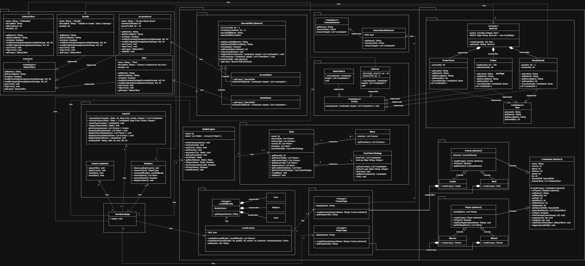
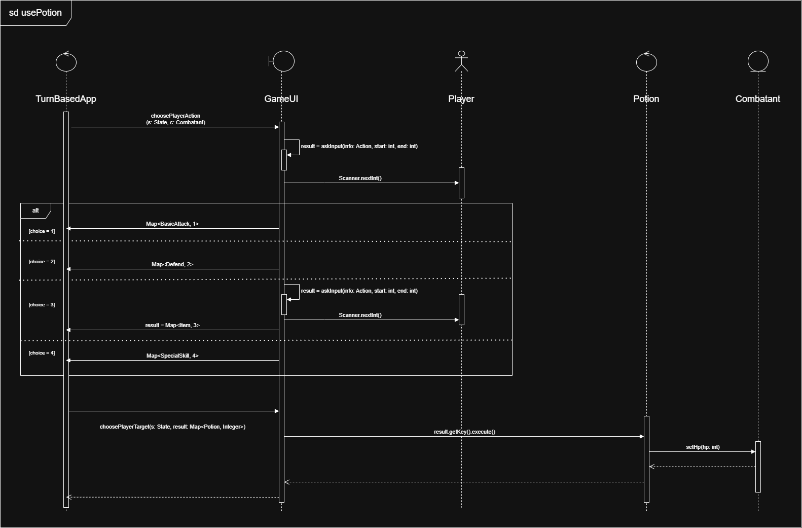

# SC2002-Assignment-TBS
Repository for SC2002 AY25/26 S2 Grp Assignment: Turn-Based Combat Arena (Java, OODP +  SOLID) 

## Diagrams
### Class Diagram

### Sequence Diagram (Potion use)

## Setup
### Step 1. Clear .class files
Type `find . -name "*.class" -delete` into the terminal (Bash)

### Step 2. Compile the files
Type `javac TurnBasedApp.java` into the terminal

### Step 3. Run it
Type `java TurnBasedApp` into the terminal

### Can run the 3 commands in 1 line
`find . -name "*.class" -delete && javac TurnBasedApp.java && java TurnBasedApp`